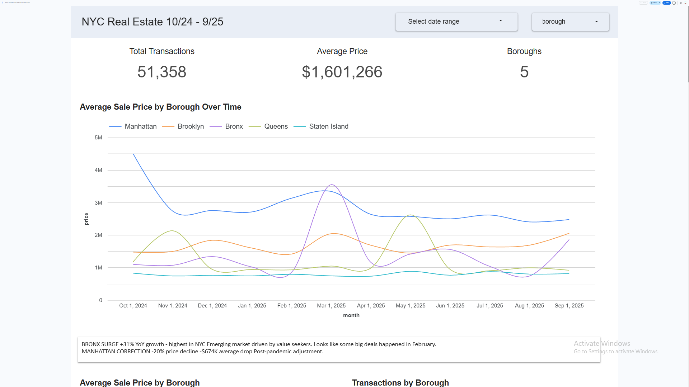

# NYC Real Estate Trends Dashboard

**[Live Dashboard](https://lookerstudio.google.com/u/0/reporting/b31ec17b-b24a-4e28-bf0d-b8d9b64b7a83/page/8NzcF)** | **[2.5-Min Demo](https://www.loom.com/share/fd58ebcf7b924364968a73d1e0c939a8)** | **[GitHub](https://github.com/Dkloh/nyc-re-trends)**

Interactive analytics dashboard analyzing **51,358 NYC property transactions** totaling **$91 billion** (Oct 2024 - Sep 2025). Reveals dramatic post-pandemic market divergence across all five boroughs.



---

## Key Findings

**Market Divergence:**
- **Bronx**: +31% YoY growth ($367K appreciation) - Strongest performer
- **Manhattan**: -20% correction ($674K decline) - Luxury market cooling
- **Queens**: 15,548 transactions - Most active market (30% of total)

**Insights:** Post-pandemic buyers seeking value in outer boroughs. Manhattan luxury segment correcting while Bronx emerges as growth leader.

---

## Tech Stack

**Data Pipeline:** Python (pandas) • Socrata API • SQLite  
**Analysis:** SQL (window functions, CTEs, aggregations)  
**Visualization:** Google Looker Studio (interactive filters)  
**Tools:** Git • Jupyter • VS Code

---

## Quick Start
```bash
# Clone and setup
git clone https://github.com/Dkloh/nyc-re-trends.git
cd nyc-re-trends
python -m venv env
source env/Scripts/activate  # Windows Git Bash
# Mac/Linux: source env/bin/activate
pip install -r requirements.txt

# Fetch and clean data (10 minutes)
python scripts/fetch_data.py  # Choose option 2 when prompted
python scripts/clean_data.py

# Explore data (optional)
jupyter notebook  # Open scripts/analysis.ipynb
```

### Quick SQL Query Example
```bash
sqlite3 data/outputs/nyc_real_estate.db

# Average price by borough
SELECT borough, 
       COUNT(*) as transactions,
       CAST(AVG(sale_price) AS INTEGER) as avg_price
FROM sales 
GROUP BY borough 
ORDER BY avg_price DESC;
```

---

## Project Highlights

### Data Engineering
- Automated API data fetching with pagination handling (79,218 records)
- Cleaned inconsistent borough codes, removed outliers, handled missing data (35% required cleaning)
- Built fully reproducible pipeline from raw data to insights

### Analysis & Insights
- SQL queries for YoY growth calculations, seasonality patterns, market segmentation
- Discovered February price spike driven by luxury Tribeca condo sales cluster
- Identified clear seasonal patterns: 18% higher transaction volume in spring months
- Revealed 2,929 ultra-luxury sales (>$5M), 85% concentrated in Manhattan

### Visualization & UX
- Interactive dashboard with real-time borough and date range filters
- 5 visualization types: line charts, bar charts, scorecards, pivot tables, distributions
- All charts dynamically update based on user filter selections
- Mobile-responsive design for accessibility

---

## What I Learned

### Technical Skills
- **API Integration:** Handling pagination, rate limiting, and error recovery with Socrata Open Data API
- **Data Quality:** 35% of raw records required cleaning—learned to identify and handle missing values, outliers, and format inconsistencies
- **SQL Optimization:** Used window functions for YoY calculations, CTEs for complex aggregations
- **Dashboard Design:** Balancing information density with visual clarity, creating intuitive user interactions

### Business Insights
- **Volume ≠ Value:** Queens leads in transactions but Manhattan dominates total market value ($40.4B)
- **Outlier Investigation:** Always investigate anomalies—February spike revealed luxury sales clustering
- **Market Segmentation:** Each borough serves distinct demographics with minimal price overlap
- **Seasonality Matters:** Spring timing can increase transaction probability by 18%

### Challenges Overcome
1. **Data Inconsistency:** Borough codes mixed with names—created mapping dictionary for standardization
2. **February Anomaly:** Investigated with SQL, found 3 luxury sales skewing averages—added annotation
3. **API Throttling:** Implemented checkpoint saving and retry logic for 79K record fetches

---

## Sample Insights from Analysis

### Year-over-Year Price Changes
```
Bronx:         +31.1% ($366,879 increase) Strongest growth
Brooklyn:      +5.0%  ($63,420 increase)
Staten Island: +1.8%  ($10,234 increase)
Queens:        -16.0% ($156,789 decrease)
Manhattan:     -20.0% ($674,018 decrease) Significant correction
```

### Transaction Volume Distribution
```
Queens:        15,548 (30.3%) Most active
Manhattan:     15,287 (29.8%)
Brooklyn:      11,387 (22.2%)
Bronx:          8,543 (16.6%)
Staten Island:  4,593 (8.9%)
```

### Price Range Segmentation
```
Manhattan:  29% under $1M  |  12% over $5M  (luxury-focused)
Brooklyn:   33% under $1M  |  <1% over $5M
Queens:     43% under $1M  |  <1% over $5M
S.Island:   64% under $1M  |  <1% over $5M  (most affordable)
```

---

## Future Enhancements

### Planned Features
- [ ] **Predictive Modeling:** ARIMA/Prophet forecasting for 6-month price predictions
- [ ] **Geographic Heatmaps:** ZIP code level visualization with coordinates
- [ ] **Automated Refresh:** Daily pipeline updates via GitHub Actions
- [ ] **Comparative Analysis:** NYC vs. San Francisco, LA, Chicago benchmarking
- [ ] **ML Price Predictions:** Random Forest model based on property features

### Expanded Data Sources
- [ ] Integrate rental market data for comprehensive market view
- [ ] Add school ratings, crime statistics, transit access for correlation analysis
- [ ] Historical 10+ year trends for long-term pattern identification

---

## Repository Structure
```
nyc-re-trends/
├── data/
│   ├── raw/              # Original API data (gitignored)
│   ├── clean/            # Processed datasets (gitignored)
│   └── outputs/          # SQLite database, summary statistics
├── scripts/
│   ├── fetch_data.py     # API data fetching with pagination
│   ├── clean_data.py     # Data cleaning and validation pipeline
│   └── analysis.ipynb    # Exploratory data analysis
├── sql/
│   └── queries.sql       # Business intelligence queries
├── docs/
│   ├── screenshots/      # Dashboard images
│   └── insights.md       # Detailed findings
├── requirements.txt      # Python dependencies
├── .gitignore           # Git ignore rules
└── README.md            # This file
```

---

## Data Sources

- **Primary Source:** [NYC Open Data - Citywide Rolling Calendar Sales](https://data.cityofnewyork.us/dataset/NYC-Citywide-Rolling-Calendar-Sales/usep-8jbt)
- **API Access:** Socrata Open Data API (automated, reproducible)
- **Coverage:** All 5 NYC boroughs, October 2024 - September 2025
- **Quality:** 79,218 raw records → 51,358 cleaned transactions (65% pass rate)

---

## Business Applications

**For Real Estate Professionals:**
- Market timing strategies (spring launch optimization)
- Geographic investment focus (Bronx growth opportunities)
- Portfolio diversification across borough segments

**For Investors:**
- Risk assessment (Manhattan correction signals)
- Value opportunities (outer borough appreciation)
- Volume indicators (Queens middle-market strength)

**For Analysts & Data Scientists:**
- End-to-end pipeline example (API → Dashboard)
- Data quality handling patterns
- Interactive visualization best practices

---

## Connect & Collaborate
 
**Email:** [derekkloh@gmail.com]  


Open to discussing:
- Real estate analytics and market trends
- Data engineering best practices
- Visualization design and dashboard UX
- Collaboration opportunities

---

## 📄 License

This project is open source and available under the MIT License.

---

*Built with Python, SQL, and Looker Studio • Transforming NYC property data into actionable insights*

**⭐ If you found this project helpful, please consider starring it on GitHub!**